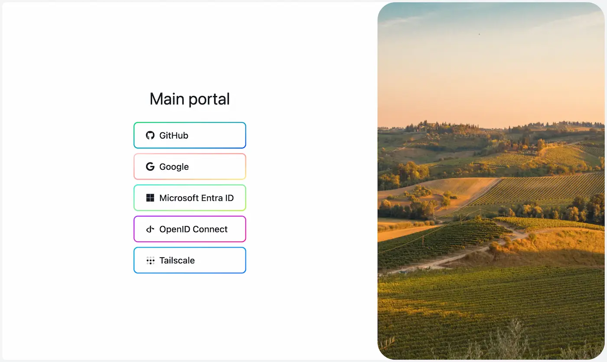

# 🛡️ Authentication Portals

Authentication portals in Traefik Forward Auth allow users to authenticate with a variety of [identity providers](./05-supported-providers.md).

You can have multiple portals configured in a single instance of Traefik Forward Auth. For example, you could have:

- A `main` portal which allows users to sign in using their Google or Microsoft Entra ID accounts
- An `admin` portal which allows authenticating with an identity provider supporting FIDO2 keys only

When more than one identity provider is configured for a portal, users will be presented with a page allowing them to choose which one to continue with:



## Configuring portals

In Traefik Forward Auth's configuration file (`tfa-config.yaml`), you need to specify at least one portal. To continue with the example above, this configuration has one `main` portal that offers both Google and Microsoft Entra ID, and an `admin` portal that uses an OpenID Connect IdP:

```yaml
# tfa-config.yaml
server:
  # Hostname where the application can be reached at externally
  hostname: "auth.example.com"

portals:
  - name: "main"
    providers:
      # Configure one provider per item in the array:
      # github, google, microsoftEntraID, openIDConnect, tailscaleWhois
      # For example, to enable both Google and Microsoft Entra ID:
      - google:
          name: "Google"
          clientID: "your-google-client-id.apps.googleusercontent.com"
          clientSecret: "your-client-secret"
      - microsoftEntraID:
          name: "Microsoft Entra ID"
          tenantID: "your-tenant-id"
          clientID: "your-client-id"
          clientSecret: "your-client-secret"

  - name: "admin"
    # Because this portal has a single provider, the provider selection page is hidden by default, unless "alwaysShowProvidersPage" is true
    alwaysShowProvidersPage: true
    providers:
      # This offers OpenID Connect only
      - openIDConnect:
          name: "Internal admin auth"
          clientID: "your-client-id"
          clientSecret: "your-client-secret"
          tokenIssuer: "https://admin-id.example.com"
```

Because the first portal in the example is named `main`, you will need to configure the forward auth middleware in Traefik to the address of Traefik Forward Auth and the path `/portals/main`. For example by setting these labels on the container:

```yaml
labels:
  - "traefik.http.middlewares.forward-auth-main.forwardauth.address=http://traefik-forward-auth:4181/portals/main"
  - "traefik.http.middlewares.forward-auth-main.forwardauth.authResponseHeaders=X-Forwarded-User,X-Authenticated-User"
  - "traefik.http.middlewares.traefik-forward-auth.forwardauth.trustForwardHeader=true"
```

You can also create a second forward auth middleware for admins:

```yaml
labels:
  - "traefik.http.middlewares.forward-auth-admin.forwardauth.address=http://traefik-forward-auth:4181/portals/admin"
  - "traefik.http.middlewares.forward-auth-admin.forwardauth.authResponseHeaders=X-Forwarded-User,X-Authenticated-User"
  - "traefik.http.middlewares.traefik-forward-auth.forwardauth.trustForwardHeader=true"
```

Your containers can then be configured with either forward auth middleware, depending on what accounts should be allowed with each app.

## Default portal

You can set a default portal which will be available at the root endpoint of Traefik Forward Auth (e.g. `/`), in addition to the typical `/portals/<name>` endpoint. This is offered for simplicity and to preserve a behavior of Traefik Forward Auth v3 or older.

To do that, set the `defaultPortal` configuration option with the name of a portal, for example (irrelevant keys have been omitted):

```yaml
# tfa-config.yaml
portals:
  - name: "main"
    # ...
  - name: "admin"
    # ...

defaultPortal: "main"
```

You can then configure Traefik to use the portal at the `/` address for using the `main` portal, omitting the portal's name. For example:

```yaml
labels:
  - "traefik.http.middlewares.forward-auth-main.forwardauth.address=http://traefik-forward-auth:4181/"
  - "traefik.http.middlewares.forward-auth-main.forwardauth.authResponseHeaders=X-Forwarded-User,X-Authenticated-User"
  - "traefik.http.middlewares.traefik-forward-auth.forwardauth.trustForwardHeader=true"
```
